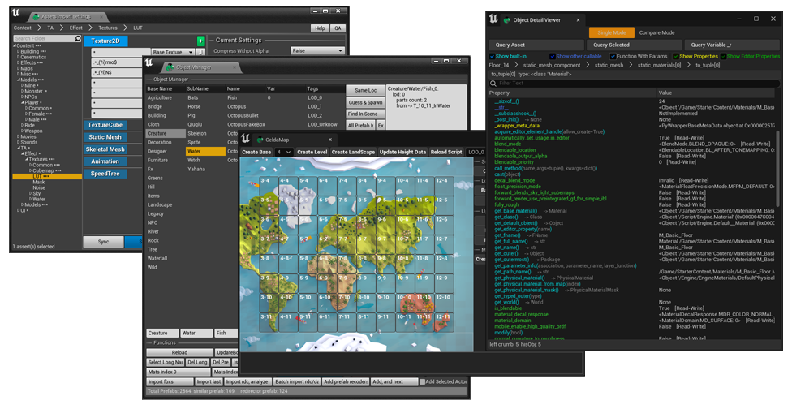
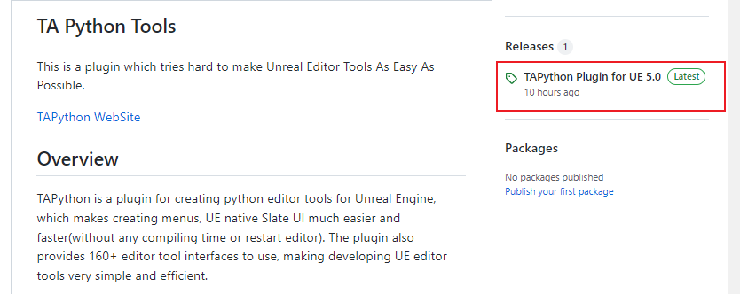
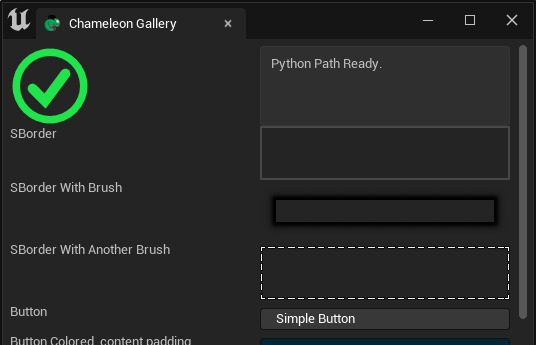
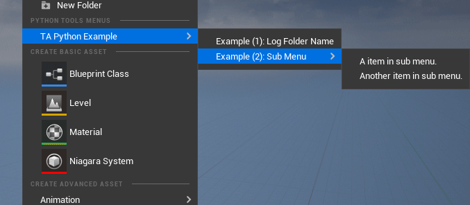
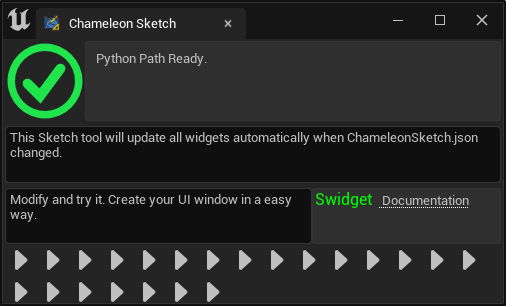

## TA Python Tools

This is a plugin which tries hard to make Unreal Editor Tools As Easy As Possible.

<a href="https://tacolor.xyz/pages/TAPython.html">TAPython WebSite</a>

## Overview


TAPython is a plugin for creating python editor tools for Unreal Engine, which makes creating menus, UE native Slate UI much easier and faster(without any compiling time or restart editor). The plugin also provides 160+ editor tool interfaces to use, making developing UE editor tools very simple and efficient.




## What's New

TAPython(1.0.3) for Unreal Engine5.0.0 Has been released.

## Feature
- Use UE4 and UE5 native Python  
- Create UE Slate UI dynamically, support 39+ Slate widgets.
- Configurable main menu/toolbar/Content Brower menu.
- Slate like syntax interface description file, real-time preview UI result, without any reload.
- Bind Python command to Slate UI widget, and change the UI content with python.
- No enging source code modified, compatible with lower versions of UE4(4.21, release later) and latest UE5
- 100+ Extra Editor Command for Python and Blutility.


## How to Install

### Prerequisites 
This plugin use UE native Python Script Plugin. The [Scripting the Editor using Python](https://docs.unrealengine.com/en-US/Engine/Editor/ScriptingAndAutomation/Python/index.html) is also very useful.


### Steps
1. Download from [TAPython release repo @github](https://github.com/cgerchenhp/UE_TAPython_Plugin_Release) and unzip the plugin to &lt;Your_UE_Project&gt;\Plugins

```
    Your_UE_Project
    ├── Content                         
    ├── ...
    └── Plugins                        
        └── TAPython       # <--- Put Plugin Here
            ├── Binaries                     
            ├── Config                     
            └── Content                   
            └─ ...
```
<a id="add_path_in_project_setting"></a>

2. Laungch project, open Project settings - Plugin Python - additional path, add &lt;Your_UE_Project&gt;/TA/TAPython/Python to additional path. then restart the editor.


3. click the **Gallery** icon on main toolbar, you should see a green check box UI like below.


Green sign and text "Python Path Ready" will showing at the top of gallery.



If a Red Cross is displayed, check the Project Setting above.


## Quick Start

The plug-in package contains several menu items and four demo tools by default. 

The latest DefaultResources is here: [DefaultResources@github](https://github.com/cgerchenhp/TAPython_DefaultResources) 


### Menu Items

- Context Menu Items in Content Browser
- Context Menu Items for selected asset
- Menu Item in Main menu
- Menu icons on Mainbar




### Sketch Tool for design/tweaking UI 


The **Sketch Tool** is a special ui design tool. When the&lt;Your_UE_Project&gt\TA\TAPython\Python\ChameleonSketch\ChameleonSketch.json file is modified, the content of the ui will be updated immediately(see below gif). This can be very useful when writing tool interfaces, and will save a lot of time when tweaking the interface layout or parameters.


The default sketch tool looks like below. Try to modify the content of ChameleonSketch.json with any text editor, and save it. Don't worry about the json keywords and syntax, it's easy to learn and has lots of examples, will be described below. 

 

---

### Example Tools

All the 4 Example tools, are written with python, **without** any single line of c++ code.


#### Tool 1: MinimalExample


This is a tool demonstrating the creation of a standard UE Slate UI with python and a json file. The Button calls Python code, then the python code sends the results(click count) back to the UI.

The tool includes a 30-lines Json file and a 15-lines Python file. In fact, it can be shorter.

I will call this kind of tool which creates Slate interfaces in this way "Chameleon Tools"

MinimalExample.json：

```
    {
        "TabLabel": "Example",
        "InitTabSize": [200, 123],
        "InitTabPosition": [680, 150],
        "InitPyCmd": "import Example; chameleon_example = Example.MinimalExample.MinimalExample(%JsonPath)",
        "Root":
        {
            "SVerticalBox":
            {
                "Slots": [
                    {
                        "SButton": {
                            "Text": "Click Me",
                            "HAlign": "Center",
                            "VAlign": "Center",
                            "OnClick": "chameleon_example.on_button_click()"
                        }
                    },
                    {
                        "SEditableTextBox":
                        {
                            "IsReadOnly": true,
                            "Aka": "InfoOutput",
                            "Text": ""
                        }
                    }
                ]
            }
        }
    }
```

MinimalExample.py

```
    # -*- coding: utf-8 -*-
    import unreal
    from Utilities.Utils import Singleton


    class MinimalExample(metaclass=Singleton):
        def __init__(self, jsonPath:str):
            self.jsonPath = jsonPath
            self.data = unreal.PythonBPLib.get_chameleon_data(self.jsonPath)
            self.ui_output = "InfoOutput"
            self.clickCount = 0

        def on_button_click(self):
            self.clickCount += 1
            self.data.set_text(self.ui_output, "Clicked {} time(s)".format(self.clickCount))
```
---

#### Tools 2 Shelf
Shelf is a Maya-like shortcut shelf tool, showing how to set visibility of widget and the usage of SDropTarget widget.

Users can drag and drop items to the shelf, and execute custom Python Code, launch Chameleon tool when clicking the item on the shelf.


| Type        |    Action  | 
|--------------|-----------|
| assets | select saved assets in content Brower|
| folder      | enter saved folder in Content Brower|
| actors      | select saved actors in level|
| text（python snippet）| execute as python code   |
| chamelon tool json file     | launch the Chameleon tool |

You can modify the python code, and make it better.

---

#### Tool 2 Object Detail Viewer


Object Detail Viewer is an inspector Tool for UE object. It shows all the functions and property in any UObject. Double click the property will query the child property. The image above shows the detail values of Floor_14(actor).static_mesh_component.static_mesh.static_materials[0].

In compare mode, the differences of two UObjects will be highlighted. It's very useful for being familiar with all kinds of UObject.


#### Tool 3 Chameleon Gallery

Chameleon Gallery shows the most common widgets, and how to describe them in a json file. All the supported widgets and API documents can be found [here]({filename}ChameleonGallery.md)


## <a href="https://tacolor.xyz/pages/TAPython.html#documentation">TAPython How to Use</a>


## FAQ
### Q0. Can UE4 use this plugin?
A: Yes, at the beginning this plugin was developed with UE 4.21. We have released this plugin for UE 4.26, 4.27, UE5.0EA, UE5.0Preview1.

### <a href="https://tacolor.xyz/pages/TAPython.html#faq">More FAQ</a>

## Links

- <a href="https://tacolor.xyz/pages/TAPython_Howto.html">How to</a>
- <a href="https://tacolor.xyz/pages/ChameleonGallery.html">Widget Gallery</a>
- <a href="https://tacolor.xyz/pages/ChameleonDataAPI.html">ChameleonData API</a>
- <a href="https://tacolor.xyz/pages/SupportedSlates.html">Supported Slates</a>
- <a href="https://tacolor.xyz/pages/PythonEditorLib.html">Extended Python Editor Lib</a>


## Contributing and feedback 

This Plugin: TAPython is **Free** for use. The [PythonDefaultResource](https://github.com/cgerchenhp/TAPython_DefaultResources)
 is under MIT license.

- Any suggestions and comments are welcome. Please don't hesitate to leave your message.
- If you encounter difficulties or problems. <a href="mailto:chpsemail@gmail.com">EMail me</a> with the problem description, screenshot and the log.
- If you find any English ambiguities or language errors on this page, please feel free to contact me as well.


