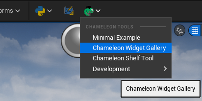
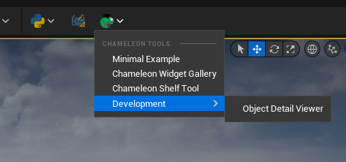
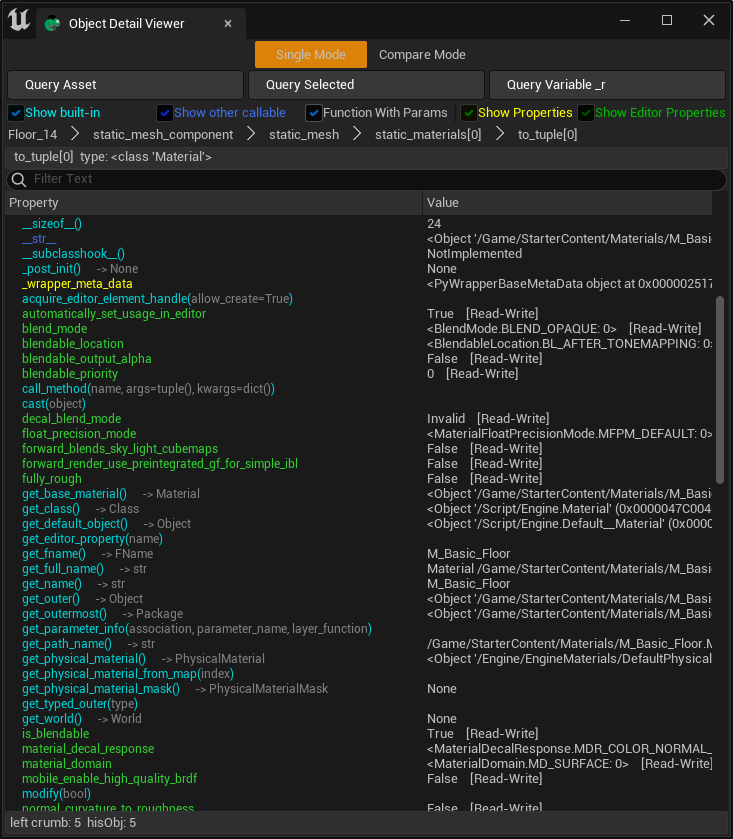
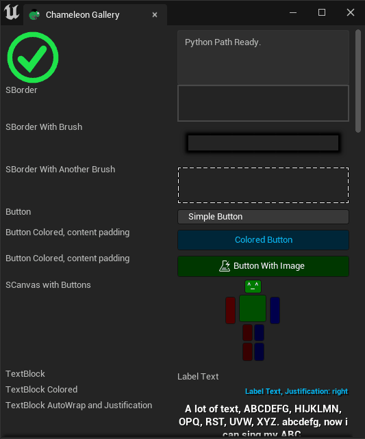

## TA Python Tools

This is a plugin which tries hard to make Unreal Editor Tools As Easy As Possible.

<a href="https://tacolor.xyz/pages/TAPython.html">TAPython WebSite</a>

## Overview


TAPython is a plugin for creating python editor tools for Unreal Engine, which makes creating menus, UE native Slate UI much easier and faster(without any compiling time or restart editor). The plugin also provides 160+ editor tool interfaces to use, making developing UE editor tools very simple and efficient.


## What's New
### In lastest v1.0.5
[PythonEnumLib](https://www.tacolor.xyz/pages/PythonEditorLib/PythonEnumLib.html) and [PythonStructLib](https://www.tacolor.xyz/pages/PythonEditorLib/PythonStructLib.html) has been added to [Python Editor Libs](https://www.tacolor.xyz/pages/PythonEditorLib.html), [PythonDataTableLib](https://www.tacolor.xyz/pages/PythonEditorLib/PythonDataTableLib.html) also adds more python/blueprint callable functions.

|PythonEnumLib |PythonStructLib |PythonDataTableLib |
|:--- |:--- |:--- |
|<a href="https://www.tacolor.xyz/pages/PythonEditorLib/PythonEnumLib.html#get_display_name_map">get_display_name_map</a>|<a href="https://www.tacolor.xyz/pages/PythonEditorLib/PythonStructLib.html#log_var_desc">log_var_desc</a>|<a href="https://www.tacolor.xyz/pages/PythonEditorLib/PythonDataTableLib.html#get_data_table_struct_path">get_data_table_struct_path</a>|
|<a href="https://www.tacolor.xyz/pages/PythonEditorLib/PythonEnumLib.html#set_enum_items">set_enum_items</a>|<a href="https://www.tacolor.xyz/pages/PythonEditorLib/PythonStructLib.html#log_var_desc_by_friendly_name">log_var_desc_by_friendly_name</a>|<a href="https://www.tacolor.xyz/pages/PythonEditorLib/PythonDataTableLib.html#get_data_table_struct">get_data_table_struct</a>|
|<a href="https://www.tacolor.xyz/pages/PythonEditorLib/PythonEnumLib.html#get_enum_len">get_enum_len</a>|<a href="https://www.tacolor.xyz/pages/PythonEditorLib/PythonStructLib.html#get_variable_description">get_variable_description</a>|<a href="https://www.tacolor.xyz/pages/PythonEditorLib/PythonDataTableLib.html#get_table_as_json">get_table_as_json</a>|
|<a href="https://www.tacolor.xyz/pages/PythonEditorLib/PythonEnumLib.html#get_display_name_by_index">get_display_name_by_index</a>|<a href="https://www.tacolor.xyz/pages/PythonEditorLib/PythonStructLib.html#get_guid_from_friendly_name">get_guid_from_friendly_name</a>|<a href="https://www.tacolor.xyz/pages/PythonEditorLib/PythonDataTableLib.html#get_row_names">get_row_names</a>|
|<a href="https://www.tacolor.xyz/pages/PythonEditorLib/PythonEnumLib.html#set_display_name">set_display_name</a>|<a href="https://www.tacolor.xyz/pages/PythonEditorLib/PythonStructLib.html#get_guid_from_property_name">get_guid_from_property_name</a>|<a href="https://www.tacolor.xyz/pages/PythonEditorLib/PythonDataTableLib.html#get_column_names">get_column_names</a>|
|<a href="https://www.tacolor.xyz/pages/PythonEditorLib/PythonEnumLib.html#get_description_by_index">get_description_by_index</a>|<a href="https://www.tacolor.xyz/pages/PythonEditorLib/PythonStructLib.html#get_variable_names">get_variable_names</a>|<a href="https://www.tacolor.xyz/pages/PythonEditorLib/PythonDataTableLib.html#get_shape">get_shape</a>|
|<a href="https://www.tacolor.xyz/pages/PythonEditorLib/PythonEnumLib.html#set_description_by_index">set_description_by_index</a>|<a href="https://www.tacolor.xyz/pages/PythonEditorLib/PythonStructLib.html#get_friendly_names">get_friendly_names</a>|<a href="https://www.tacolor.xyz/pages/PythonEditorLib/PythonDataTableLib.html#remove_row">remove_row</a>|
|<a href="https://www.tacolor.xyz/pages/PythonEditorLib/PythonEnumLib.html#get_name_by_index">get_name_by_index</a>|<a href="https://www.tacolor.xyz/pages/PythonEditorLib/PythonStructLib.html#is_unique_friendly_name">is_unique_friendly_name</a>|<a href="https://www.tacolor.xyz/pages/PythonEditorLib/PythonDataTableLib.html#add_row">add_row</a>|
|<a href="https://www.tacolor.xyz/pages/PythonEditorLib/PythonEnumLib.html#move_enum_item">move_enum_item</a>|<a href="https://www.tacolor.xyz/pages/PythonEditorLib/PythonStructLib.html#add_variable">add_variable</a>|<a href="https://www.tacolor.xyz/pages/PythonEditorLib/PythonDataTableLib.html#duplicate_row">duplicate_row</a>|
|<a href="https://www.tacolor.xyz/pages/PythonEditorLib/PythonEnumLib.html#is_bitflags_type">is_bitflags_type</a>|<a href="https://www.tacolor.xyz/pages/PythonEditorLib/PythonStructLib.html#add_directory_variable">add_directory_variable</a>|<a href="https://www.tacolor.xyz/pages/PythonEditorLib/PythonDataTableLib.html#rename_row">rename_row</a>|
|<a href="https://www.tacolor.xyz/pages/PythonEditorLib/PythonEnumLib.html#set_bitflags_type">set_bitflags_type</a>|<a href="https://www.tacolor.xyz/pages/PythonEditorLib/PythonStructLib.html#remove_variable_by_name">remove_variable_by_name</a>|<a href="https://www.tacolor.xyz/pages/PythonEditorLib/PythonDataTableLib.html#reset_row">reset_row</a>|
|<a href="https://www.tacolor.xyz/pages/PythonEditorLib/PythonEnumLib.html#get_cpp_form">get_cpp_form</a>|<a href="https://www.tacolor.xyz/pages/PythonEditorLib/PythonStructLib.html#rename_variable">rename_variable</a>|<a href="https://www.tacolor.xyz/pages/PythonEditorLib/PythonDataTableLib.html#move_row">move_row</a>|
| |<a href="https://www.tacolor.xyz/pages/PythonEditorLib/PythonStructLib.html#change_variable_default_value">change_variable_default_value</a>|<a href="https://www.tacolor.xyz/pages/PythonEditorLib/PythonDataTableLib.html#get_row_name">get_row_name</a>|
| | |<a href="https://www.tacolor.xyz/pages/PythonEditorLib/PythonDataTableLib.html#get_column_name">get_column_name</a>|
| | |<a href="https://www.tacolor.xyz/pages/PythonEditorLib/PythonDataTableLib.html#get_flatten_data_table">get_flatten_data_table</a>|
| | |<a href="https://www.tacolor.xyz/pages/PythonEditorLib/PythonDataTableLib.html#get_property_as_string">get_property_as_string</a>|
| | |<a href="https://www.tacolor.xyz/pages/PythonEditorLib/PythonDataTableLib.html#get_property_as_string_at">get_property_as_string_at</a>|
| | |<a href="https://www.tacolor.xyz/pages/PythonEditorLib/PythonDataTableLib.html#set_property_by_string">set_property_by_string</a>|
| | |<a href="https://www.tacolor.xyz/pages/PythonEditorLib/PythonDataTableLib.html#set_property_by_string_at">set_property_by_string_at</a>|


 In short, we can use Python to do almost everything you did manually in the editor with **User defined ENum, User Defined Struct and DataTable**. More details and examples can be found [here](https://www.tacolor.xyz/Howto/How_To_Create_User_Defined_ENum_Struct_DataTable_with_Python_in_UE5.html).


### v1.0.4
Support more slates:
#### Now we can create widge: [SSplitter](https://www.tacolor.xyz/pages/Widgets/SSplitter.html)


#### And [SExpandableArea](https://www.tacolor.xyz/pages/Widgets/SExpandableArea.html)


Two APIs was added in [ChameleonData](https://www.tacolor.xyz/pages/ChameleonDataAPI.html) for [SExpandableArea](https://www.tacolor.xyz/pages/Widgets/SExpandableArea.html):
  1. bool GetIsExpanded(const FName AkaName)
  2. void SetIsExpanded(const FName AkaName, bool bExpanded, bool bAnimated=false)
```
data.get_is_expanded(aka_name) -> bool
    Get the Expanded state of Specified SExpandableArea
    note: Supported widgets: SExpandableArea.
    note: added in v1.0.4

    Args:
        aka_name (Name): The aka name of the widget

    Returns:
        bool: Is Expanded or not.
```

```
	data.set_is_expanded(aka_name, expanded, animated=False) -> None
	    Set the Expanded state of Specified SExpandableArea
	    note: Supported widgets: SExpandableArea.
	    note: added in v1.0.4
	
	    Args:
	        aka_name (Name): The aka name of the widget
	        expanded (bool): Is Expanded or not.
	        animated (bool): Expanded with animation or not.
```

### Add Context menu in Outline window

Now we can add context menu in Outline window, with the "OnOutlineMenu" field in MenuConfig.ini.  


```json
    "OnOutlineMenu": {
        "name:": "Python Menu On OutlineMenu",
        "items":
        [
            {
                "name": "Print selected actors",
                "command": "print(unreal.get_editor_subsystem(unreal.EditorActorSubsystem).get_selected_level_actors())"
            }
        ]
    },
```


### Add configurable icons in front the menu item 


The .png and.svg files in the plugin resource directory will be added to "ChameleonStyle" automatically. Then we can use it for menu items.


- We can specify the icon of a menu item with a relative path of the icon image in the plug-in resource directory.
``` json
    {
        "name": "Chameleon Shelf Tool",
        "ChameleonTools": "../Python/ShelfTools/Shelf.json",
        "icon": {
            "ImagePathInPlugin": "Resources/briefcase_32x.png"
        }
    },
```
- Or use ImageBrush directly in the style. For instance, the image brushes in FEditorStyle, FCoreStyle
```json
    {
        "name": "Minimal Example",
        "ChameleonTools": "../Python/Example/MinimalExample.json",
        "icon": {
            "style": "ChameleonStyle",
            "name": "Flash"
        }
    }
```

### The Chameleon UI .json file can reference other json files.
 
Now the Chameleon UI json file can reference other Json files. Nested references are supported, but circular references need to be avoided


```json
    {
        "autoWidth": true,
        "SBox": {
            "WidthOverride": 480,
            "Content": {
                "ExternalJson": "ZeldaWorldMapEditor_Buttons.json"
            }
        }
    }
```


#### pros:
- Reduce the complexity and size of a single json file
- reuse part ui code 

#### cons:
- The UI json files becomes less intuitive and more obscure
- The Widget path logged in the console window is not the same as the Json crumb path shown in PyCharm. As PyCharm don't know that another json content has being "import" here.

#### recommendation:
- Put the repetitive ui code (such as 16x16 map buttons) or the ui code which generated by other script into an "external" json file.


### The number of shortcut keys has been increased to 10
  
The number of shortcuts that can be configured in ExitorSettings has now been increased to 10. It will be a configurable number in later version.

 

### Add "BorderBackgroundColor" of SBorder
 ```json
    {
        "SBorder": {
            "BorderBackgroundColor": [1, 0.5, 0, 1],
            "BorderImage":
            {
                "Style": "FEditorStyle",
                "Brush": "ErrorReporting.EmptyBox"
            }
        }
    }
```

### Add More API in PythonBPLib:

- GetViewportPixels
Now we can grab and get the content of viewport. Use it in tools widgets:


Or send it to other device, for example, I send the viewport content to my MacroKeyboard. I think this is the smallest screen which displays Unreal Engine viewport content :D


- ViewportRedraw

Force the viewport Redraw

- GetObjectFlags

We can get the EObjectFlags of a UObject.


 
- GetLevelViewportCameraFov


- GetActorsFromFolder
Get the actors in Specified folder in outline

- FindActorsByLabelName
- 
Find the actor by it's "label name" not the "actor name" 


### Config.ini
- add LogOnTickWarnings in config.ini
```ini
  LogOnTickWarnings=True
```
This option controls whether a warning is printed when the user uses the keyword OnTick.

ChameleonTools has a hidden keyword that has not been mentioned: "OnTick". The python code in it is executed during Slate updates, which are much more frequent than viewPort updates, So the py code can easily lower the editor's FPS.

"OnTick" is hidden because 99.9% of the time it is not needed and there are better ways to do it if there is a "real" need. So I don't recommend using OnTick and changing the LogOnTickWarnings setting.


### Fixed:

- Fixed RequestClose failing after Chameleon dock to another window.

- Fixed unreal.PythonBp.get_all_objects crash, when some objects don't have "world"

- Fixed the incorrect display of the Breadcrumb in Python Tool: ObjectDetailViewer

- Fixed chameleonData.get_float_value failed with SSpinBox

- Fixed incorrect Padding setting in SBox

## Feature
- Use UE4 and UE5 native Python  
- Create UE Slate UI dynamically, support 39+ Slate widgets.
- Configurable main menu/toolbar/Content Brower menu.
- Slate like syntax interface description file, real-time preview UI result, without any reload.
- Bind Python command to Slate UI widget, and change the UI content with python.
- No enging source code modified, compatible with lower versions of UE4(4.21, release later) and latest UE5
- 100+ Extra Editor Command for Python and Blutility.


## How to Install

### Prerequisites 
This plugin use UE native Python Script Plugin. The [Scripting the Editor using Python](https://docs.unrealengine.com/en-US/Engine/Editor/ScriptingAndAutomation/Python/index.html) is also very useful.


### Steps
1. Download from [TAPython release repo @github](https://github.com/cgerchenhp/UE_TAPython_Plugin_Release) and unzip the plugin to &lt;Your_UE_Project&gt;\Plugins

```
    Your_UE_Project
    ├── Content                         
    ├── ...
    └── Plugins                        
        └── TAPython       # <--- Put Plugin Here
            ├── Binaries                     
            ├── Config                     
            └── Content                   
            └─ ...
```
<a id="add_path_in_project_setting"></a>

2. Laungch project, open Project settings - Plugin Python - additional path, add &lt;Your_UE_Project&gt;/TA/TAPython/Python to additional path. then restart the editor.


3. click the **Gallery** icon on main toolbar, you should see a green check box UI like below.



Green sign and text "Python Path Ready" will showing at the top of gallery.


If a Red Cross is displayed, check the Project Setting above.


## Quick Start

The plug-in package contains several menu items and four demo tools by default. 

The latest DefaultResources is here: [DefaultResources@github](https://github.com/cgerchenhp/TAPython_DefaultResources) 


### Menu Items

- Context Menu Items in Content Browser
- Context Menu Items for selected asset
- Menu Item in Main menu
- Menu icons on Mainbar


### Sketch Tool for design/tweaking UI 


The **Sketch Tool** is a special ui design tool. When the&lt;Your_UE_Project&gt\TA\TAPython\Python\ChameleonSketch\ChameleonSketch.json file is modified, the content of the ui will be updated immediately(see below gif). This can be very useful when writing tool interfaces, and will save a lot of time when tweaking the interface layout or parameters.


The default sketch tool looks like below. Try to modify the content of ChameleonSketch.json with any text editor, and save it. Don't worry about the json keywords and syntax, it's easy to learn and has lots of examples, will be described below. 

 

---

### Example Tools

All the 4 Example tools, are written with python, **without** any single line of c++ code.



#### Tool 1: MinimalExample


This is a tool demonstrating the creation of a standard UE Slate UI with python and a json file. The Button calls Python code, then the python code sends the results(click count) back to the UI.

The tool includes a 30-lines Json file and a 15-lines Python file. In fact, it can be shorter.

I will call this kind of tool which creates Slate interfaces in this way "Chameleon Tools"

MinimalExample.json：

```
    {
        "TabLabel": "Example",
        "InitTabSize": [200, 123],
        "InitTabPosition": [680, 150],
        "InitPyCmd": "import Example; chameleon_example = Example.MinimalExample.MinimalExample(%JsonPath)",
        "Root":
        {
            "SVerticalBox":
            {
                "Slots": [
                    {
                        "SButton": {
                            "Text": "Click Me",
                            "HAlign": "Center",
                            "VAlign": "Center",
                            "OnClick": "chameleon_example.on_button_click()"
                        }
                    },
                    {
                        "SEditableTextBox":
                        {
                            "IsReadOnly": true,
                            "Aka": "InfoOutput",
                            "Text": ""
                        }
                    }
                ]
            }
        }
    }
```

MinimalExample.py

```
    # -*- coding: utf-8 -*-
    import unreal
    from Utilities.Utils import Singleton


    class MinimalExample(metaclass=Singleton):
        def __init__(self, jsonPath:str):
            self.jsonPath = jsonPath
            self.data = unreal.PythonBPLib.get_chameleon_data(self.jsonPath)
            self.ui_output = "InfoOutput"
            self.clickCount = 0

        def on_button_click(self):
            self.clickCount += 1
            self.data.set_text(self.ui_output, "Clicked {} time(s)".format(self.clickCount))
```
---

#### Tools 2 Shelf
Shelf is a Maya-like shortcut shelf tool, showing how to set visibility of widget and the usage of SDropTarget widget.

Users can drag and drop items to the shelf, and execute custom Python Code, launch Chameleon tool when clicking the item on the shelf.


| Type        |    Action  | 
|--------------|-----------|
| assets | select saved assets in content Brower|
| folder      | enter saved folder in Content Brower|
| actors      | select saved actors in level|
| text（python snippet）| execute as python code   |
| chamelon tool json file     | launch the Chameleon tool |

You can modify the python code, and make it better.

---

#### Tool 2 Object Detail Viewer


Object Detail Viewer is an inspector Tool for UE object. It shows all the functions and property in any UObject. Double click the property will query the child property. The image above shows the detail values of Floor_14(actor).static_mesh_component.static_mesh.static_materials[0].

In compare mode, the differences of two UObjects will be highlighted. It's very useful for being familiar with all kinds of UObject.


#### Tool 3 Chameleon Gallery

Chameleon Gallery shows the most common widgets, and how to describe them in a json file. All the supported widgets and API documents can be found [here]({filename}ChameleonGallery.md)





## <a href="https://tacolor.xyz/pages/TAPython.html#documentation">TAPython How to Use</a>


## FAQ
### Q0. Can UE4 use this plugin?
A: Yes, at the beginning this plugin was developed with UE 4.21. We have released this plugin for UE 4.26, 4.27, UE5.0EA, UE5.0Preview1.

### <a href="https://tacolor.xyz/pages/TAPython.html#faq">More FAQ</a>

## Links

- <a href="https://tacolor.xyz/pages/TAPython_Howto.html">How to</a>
- <a href="https://tacolor.xyz/pages/ChameleonGallery.html">Widget Gallery</a>
- <a href="https://tacolor.xyz/pages/ChameleonDataAPI.html">ChameleonData API</a>
- <a href="https://tacolor.xyz/pages/SupportedSlates.html">Supported Slates</a>
- <a href="https://tacolor.xyz/pages/PythonEditorLib.html">Extended Python Editor Lib</a>


## Contributing and feedback 

This Plugin: TAPython is **Free** for use. The [PythonDefaultResource](https://github.com/cgerchenhp/TAPython_DefaultResources)
 is under MIT license.

- Any suggestions and comments are welcome. Please don't hesitate to leave your message.
- If you encounter difficulties or problems. <a href="mailto:chpsemail@gmail.com">EMail me</a> with the problem description, screenshot and the log.
- If you find any English ambiguities or language errors on this page, please feel free to contact me as well.


